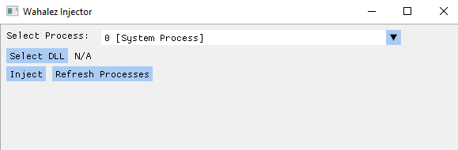

## Wahalez Injector

#### Description
A simple [DLL](https://en.wikipedia.org/wiki/Dynamic-link_library "DLL") Injector using [Dear ImGui](https://github.com/ocornut/imgui "Dear ImGui") and [Win32 API](https://learn.microsoft.com/en-us/windows/win32/ "Win32 API").

#### Building
[CMake](https://cmake.org/ "CMake") is required to build the project. 
In command line,  cd to the project folder and make a new build directory: 
`mkdir build`
change directory to the build directory:
`cd build`
Then, run the next commands to build the executable file: 
1. `cmake ..`
2. `cmake --build.`

The executable file can be found in the same \ Debug directory. 

#### Usage
Usage is simple, pick a process that is to be injected to, pick the dll file and click Inject. 
A prompt will popup saying wether the operation succeeded or not.

